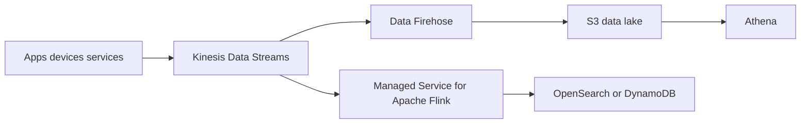
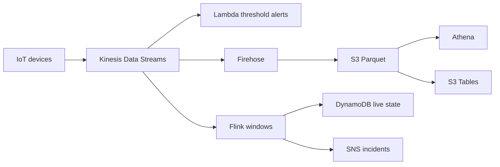

# Realtime Analytics Streaming with Kinesis

## Use case

Capture continuous events from clickstream, IoT, application logs, or telemetry for realtime aggregations and historical storage.

## Main decision

Use **Kinesis Data Streams** when you need continuous ingestion, ordering by shard/partition key, retention, and independent consumers inside the AWS ecosystem.

Use **SQS** for async tasks without replay. Use **MSK** if your organization already operates Kafka or needs Kafka APIs. Use **direct Firehose** if you only want to deliver data to S3/OpenSearch/Redshift without custom consumers.

## Key questions

- Do you need replay from an earlier position?
- Are there several consumers reading the same data?
- Does ordering by entity matter?
- Is volume sustained or just spiky?
- Do you need windows, joins, or aggregations?
- How long should events be retained?

## Why these services

- **Kinesis Data Streams**: managed log with retention and consumers.
- **Flink**: stateful processing, windows, joins, enrichment.
- **Firehose**: managed delivery to S3/OpenSearch/Redshift.
- **S3 + Athena**: queryable history.

## Pros

- Good fit for AWS-native streaming.
- Replay within retention.
- Direct integration with Lambda, Flink, and Firehose.
- Less operation than Kafka.
- Ordering by partition key.

## Cons

- Partition key design is critical.
- Shards/capacity must be understood if not using on-demand mode.
- It is not a simple task queue.
- Stateful processing adds complexity.
- Costs grow with volume and retention.

## Alerts and cost

Minimum:

- IteratorAgeMilliseconds or consumer lag.
- PutRecord throttling.
- IncomingBytes/Records.
- Flink checkpoint failures and backpressure.
- Firehose delivery failures.
- Budget for ingestion, enhanced fan-out, retention, and processing.

## Natural evolution

- If you only store to S3: simplify with Firehose.
- If you need Kafka API: migrate or integrate with MSK.
- If an aggregation becomes critical: Flink with checkpoints and alarms.
- If hot partitions appear: redesign partition key.
- If historical analytics dominates: model S3 Tables/Iceberg.

## Applied Examples

### Example 1: Cold-chain IoT telemetry

**Context:** Refrigerated trucks send temperature, location, and battery data every few seconds. Operations needs immediate alerts and historical analytics.

**Questions and answers:**

- **Is this messaging or streaming?** Streaming. It needs retention, replay, ordering by device, and multiple independent consumers.
- **When should Flink be used?** When the workload needs windows, complex event detection, or joins with route-specific thresholds; Firehose is enough for simple S3 delivery.
- **How is backpressure handled?** Shards/on-demand capacity, partitioning by `vehicleId`, IteratorAge alarms, and DLQ/on-failure destinations for Lambda consumers.

**Architecture by stage:**

- **Initial project:** Devices publish through API/IoT Core to Kinesis Data Streams; Lambda detects thresholds and Firehose delivers Parquet to S3.
- **Middle stage:** Managed Service for Apache Flink calculates windows, DynamoDB stores operational state, SNS alerts incidents, and Athena queries history.
- **Large-scale projection:** Multi-region ingestion, enhanced fan-out for critical consumers, S3 Tables/Iceberg for the lakehouse, and OpenSearch for operational search.

**Migration/evolution:** If readings are inserted directly into SQL today, put Kinesis in front, replicate to the current database as a consumer, and move analytics to S3 without stopping producers.

**Related patterns:** [data-lake-s3-tables-athena](../data-lake-s3-tables-athena/index.md), [observability-cloudwatch-xray-adot](../observability-cloudwatch-xray-adot/index.md), [kafka-msk-event-streaming](../kafka-msk-event-streaming/index.md).

## Practice exercise

Design ingestion for `page_view` events. Define partition key, retention, realtime consumer, S3 delivery, and lag alarm.

