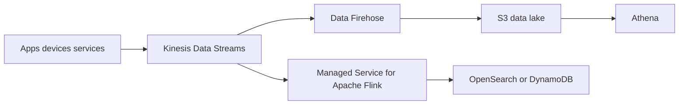

# Streaming Realtime Analytics con Kinesis

## Caso de uso

Capturar eventos continuos de clickstream, IoT, logs de aplicacion o telemetria para agregaciones en tiempo real y almacenamiento historico.

## Decision principal

Usa **Kinesis Data Streams** cuando necesitas ingestion continua, orden por shard/partition key, retencion y consumidores independientes dentro del ecosistema AWS.

Usa **SQS** para tareas asincronas sin replay. Usa **MSK** si tu organizacion ya opera Kafka o necesita APIs Kafka. Usa **Firehose directo** si solo quieres entregar datos a S3/OpenSearch/Redshift sin consumidores custom.

## Preguntas clave

- Necesitas replay desde una posicion anterior?
- Hay varios consumidores leyendo lo mismo?
- Importa orden por entidad?
- El volumen es sostenido o solo picos?
- Necesitas ventanas, joins o agregaciones?
- Cuanto tiempo debes retener eventos?

## Por que estos servicios

- **Kinesis Data Streams**: log administrado con retencion y consumidores.
- **Flink**: procesamiento stateful, ventanas, joins y enriquecimiento.
- **Firehose**: entrega administrada a S3/OpenSearch/Redshift.
- **S3 + Athena**: historico consultable.

## Pros

- Buen fit para AWS-native streaming.
- Replay dentro de retencion.
- Integracion directa con Lambda, Flink y Firehose.
- Menos operacion que Kafka.
- Orden por partition key.

## Contras

- Diseno de partition key es critico.
- Shards/capacidad deben entenderse si no usas modo on-demand.
- No es cola de tareas simple.
- Procesamiento stateful agrega complejidad.
- Costos crecen con volumen y retencion.

## Alertas y costos

Minimo:

- IteratorAgeMilliseconds o consumer lag.
- PutRecord throttling.
- IncomingBytes/Records.
- Flink checkpoint failures y backpressure.
- Firehose delivery failures.
- Budget por ingestion, enhanced fan-out, retencion y procesamiento.

## Evolucion natural

- Si solo guardas en S3: simplificar con Firehose.
- Si necesitas API Kafka: migrar o integrar con MSK.
- Si una agregacion se vuelve critica: Flink con checkpoints y alarmas.
- Si particiones calientes aparecen: redisenar partition key.
- Si analitica historica domina: modelar S3 Tables/Iceberg.

## Ejercicio de practica

Disena ingestion de eventos `page_view`. Define partition key, retencion, consumidor realtime, entrega a S3 y alarma por lag.

