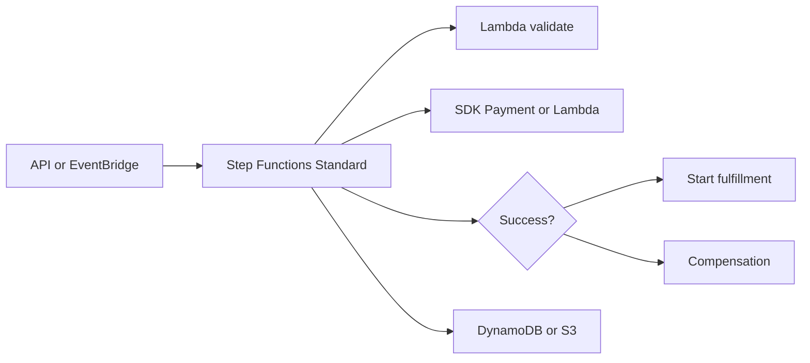
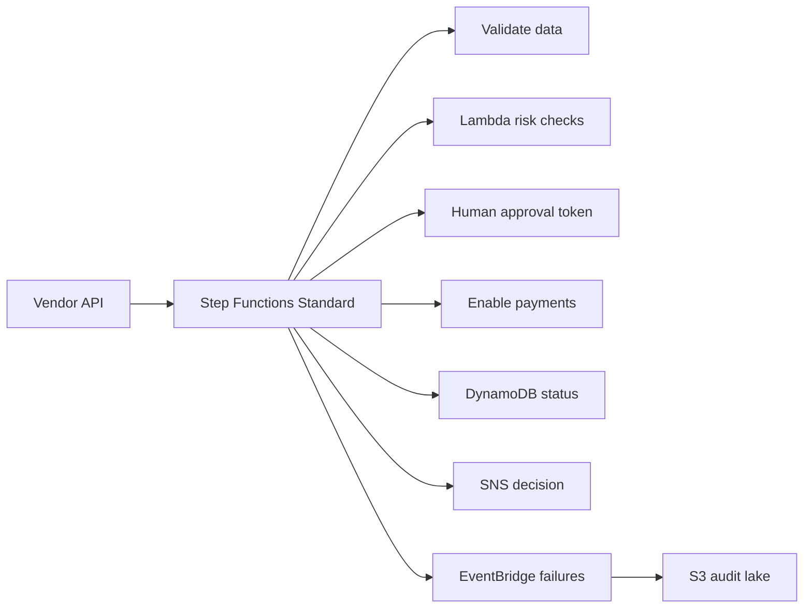

# Orchestration with Step Functions

## Use case

Order process with several steps: validate cart, reserve inventory, charge payment, generate invoice, notify, and compensate if something fails.

## Main decision

Use **Step Functions** when you need visible steps, retries, catch, branching, timeouts, parallelism, or compensations.

Use a **simple Lambda** if the operation is short and linear. Use **EventBridge** if you only route independent events. Use **MWAA** for complex data pipelines with analytics DAGs.

## Key questions

- Are there multiple steps with intermediate state?
- Do you need retries per step?
- Is there saga-style compensation?
- Can the flow last minutes, hours, or days?
- Does the payload exceed 256 KB?
- Is there human approval or callbacks?

## Why these services

- **Standard workflows**: exactly one logical execution and up to one year.
- **Express workflows**: high volume and short duration.
- **SDK integrations**: call AWS services without intermediate Lambda.
- **Choice/Parallel/Map**: managed flow control.
- **CloudWatch/X-Ray**: visibility per state.

## Pros

- Visible state and errors.
- Less custom orchestration code.
- Declarative retries and timeouts.
- Good fit for sagas.
- Easy to audit executions.

## Cons

- Cost per state transition.
- Payload is limited.
- ASL adds a learning curve.
- Very large workflows can become hard to maintain.
- Express has different semantics than Standard.

## Alerts and cost

Minimum:

- ExecutionsFailed, ExecutionsTimedOut, ExecutionsAborted.
- Lambda task errors per state.
- DLQ/backlog if integrated with queues.
- Budget for state transitions.

Guardrails:

- Store large payloads in S3 and pass references.
- Prefer SDK integrations over glue Lambda.
- Define retry and catch by expected error.
- Log a correlation ID end-to-end.

## Natural evolution

- If the flow is data batch: Glue/MWAA.
- If it needs events between domains: publish events to EventBridge.
- If one step is slow or CPU-heavy: move it to an ECS task.
- If transition cost grows: group steps or use Express where appropriate.
- If subflows repeat: create child workflows.

## Applied Examples

### Example 1: Vendor onboarding with approvals

**Context:** A marketplace must register vendors, validate documents, check risk lists, request human approval, and enable payouts.

**Questions and answers:**

- **Is this a long task with visible state?** Yes. Step Functions Standard supports human waits, retries, compensations, and per-step auditability.
- **Which steps do not need Lambda?** Simple validations, SDK calls to DynamoDB/SNS/EventBridge, and JSONata transforms can avoid glue functions.
- **Where do large payloads go?** Documents and bulky results go to S3; the state machine moves only references.

**Architecture by stage:**

- **Initial project:** API creates a request, Step Functions validates data, Lambda calls external providers, DynamoDB stores status, and SNS sends the decision.
- **Middle stage:** `.waitForTaskToken` for human approval, retries with jitter, Catch by error type, EventBridge for failures, and DLQ-backed integrations.
- **Large-scale projection:** Distributed Map for large batches, child workflows by country, a separate compliance account, and a Lakehouse for audit.

**Migration/evolution:** If a giant Lambda holds manual state today, extract error branches and waits into Step Functions first, leaving business logic in small functions.

**Related patterns:** [file-processing-s3-stepfunctions](../file-processing-s3-stepfunctions/index.md), [event-driven-domain-bus-eventbridge](../event-driven-domain-bus-eventbridge/index.md), [security-iam-secrets-oidc](../security-iam-secrets-oidc/index.md).

## Practice exercise

Model an order saga with payment compensation. Define states, recoverable errors, final errors, and success metrics.

