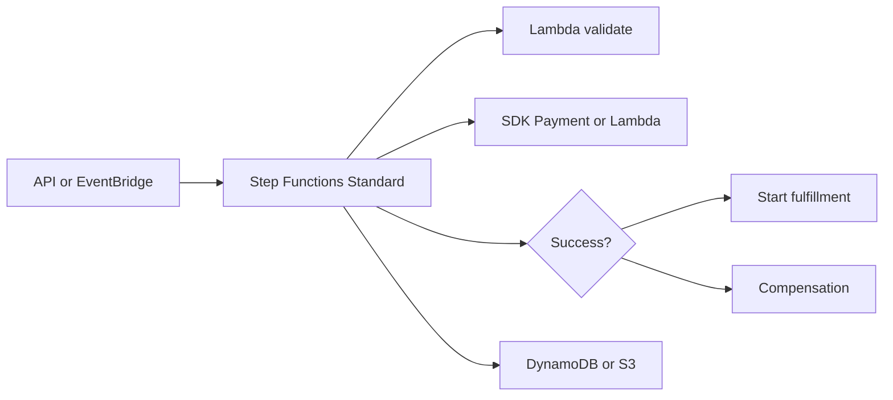
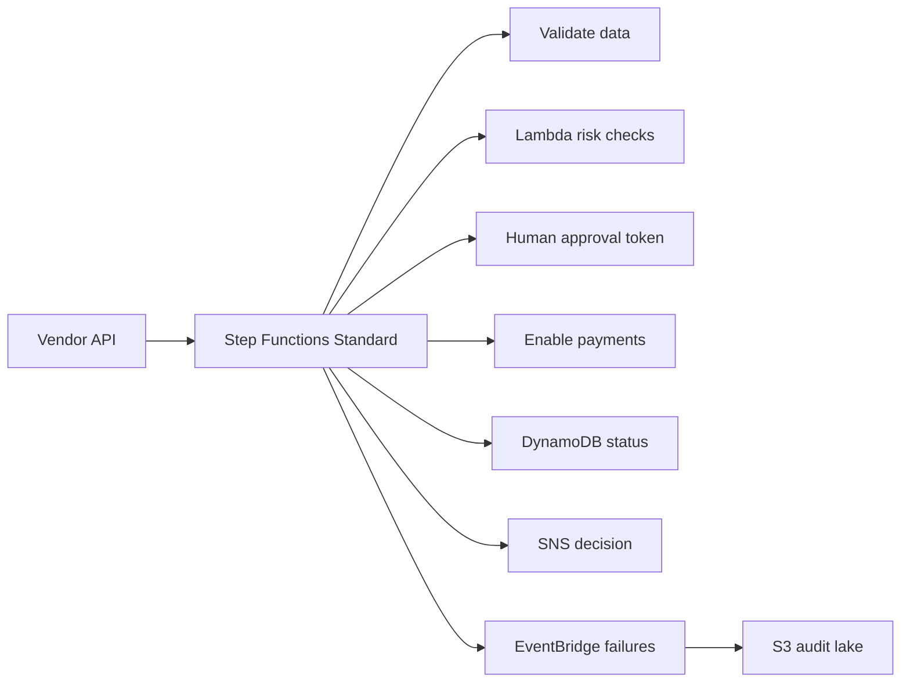

# Orquestacion con Step Functions

## Caso de uso

Proceso de orden con varios pasos: validar carrito, reservar inventario, cobrar pago, generar factura, notificar y compensar si algo falla.

## Decision principal

Usa **Step Functions** cuando necesitas pasos visibles, retries, catch, branching, timeouts, paralelismo o compensaciones.

Usa **Lambda simple** si la operacion es corta y lineal. Usa **EventBridge** si solo enrutas eventos independientes. Usa **MWAA** para data pipelines complejos con DAGs de analitica.

## Preguntas clave

- Hay mas de un paso con estados intermedios?
- Necesitas reintentos por paso?
- Existe compensacion tipo saga?
- El flujo puede durar minutos, horas o dias?
- El payload supera 256 KB?
- Hay aprobacion humana o callbacks?

## Por que estos servicios

- **Standard workflows**: exactamente una ejecucion logica y hasta un ano.
- **Express workflows**: alto volumen y duracion corta.
- **SDK integrations**: llaman servicios AWS sin Lambda intermedia.
- **Choice/Parallel/Map**: control de flujo administrado.
- **CloudWatch/X-Ray**: visibilidad por estado.

## Pros

- Estado y errores visibles.
- Menos codigo de orquestacion propio.
- Retries y timeouts declarativos.
- Buen fit para sagas.
- Facil auditar ejecuciones.

## Contras

- Costo por state transition.
- Payload limitado.
- ASL agrega curva de aprendizaje.
- Workflows muy grandes pueden volverse dificiles de mantener.
- Express tiene semanticas distintas a Standard.

## Alertas y costos

Minimo:

- ExecutionsFailed, ExecutionsTimedOut, ExecutionsAborted.
- Lambda task errors por estado.
- DLQ/backlog si se integra con colas.
- Budget por state transitions.

Guardrails:

- Guardar payloads grandes en S3 y pasar referencias.
- Preferir SDK integrations sobre Lambda pegamento.
- Definir retry y catch por error esperado.
- Loggear correlation ID de punta a punta.

## Evolucion natural

- Si el flujo es de datos batch: Glue/MWAA.
- Si necesita eventos entre dominios: publicar eventos en EventBridge.
- Si un paso es lento o CPU-heavy: moverlo a ECS task.
- Si el costo de transitions sube: agrupar pasos o usar Express donde aplique.
- Si se repiten subflujos: crear workflows hijos.

## Ejemplos aplicados

### Ejemplo 1: Onboarding de proveedores con aprobaciones

**Contexto:** Un marketplace debe registrar proveedores, validar documentos, consultar listas de riesgo, pedir aprobacion humana y activar pagos.

**Preguntas y respuestas:**

- **Es una tarea larga con estados visibles?** Si. Step Functions Standard permite espera humana, retries, compensaciones y auditoria de cada paso.
- **Que pasos no necesitan Lambda?** Validaciones simples, llamadas SDK a DynamoDB/SNS/EventBridge y transformaciones JSONata pueden evitar funciones pegamento.
- **Donde guardar payloads grandes?** Documentos y resultados voluminosos van a S3; la maquina de estados solo mueve referencias.

**Diseno por etapa:**

- **Proyecto inicial:** API crea solicitud, Step Functions valida datos, Lambda consulta proveedores externos, DynamoDB guarda estado y SNS notifica decision.
- **Etapa media:** `.waitForTaskToken` para aprobacion humana, retries con jitter, Catch por tipo de error, EventBridge para fallos y DLQ de integraciones.
- **Gran escala:** Distributed Map para lotes masivos, flujos hijos por pais, cuenta separada de compliance y Lakehouse para auditoria.

**Migracion/evolucion:** Si existe un Lambda gigante con estado manual, extraer primero las ramas de error y los waits a Step Functions, dejando la logica de negocio en funciones pequenas.

**Patrones relacionados:** [file-processing-s3-stepfunctions](../file-processing-s3-stepfunctions/index.md), [event-driven-domain-bus-eventbridge](../event-driven-domain-bus-eventbridge/index.md), [security-iam-secrets-oidc](../security-iam-secrets-oidc/index.md).

## Ejercicio de practica

Modela una saga de pedido con compensacion de pago. Define estados, errores recuperables, errores finales y metricas de exito.

